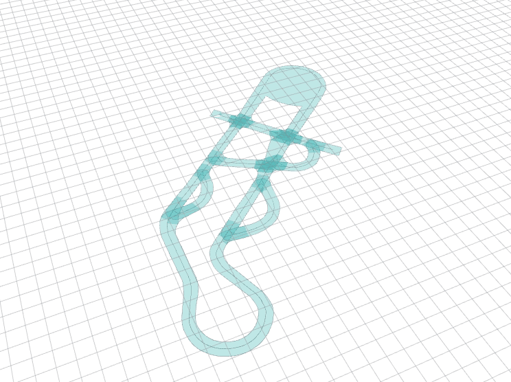
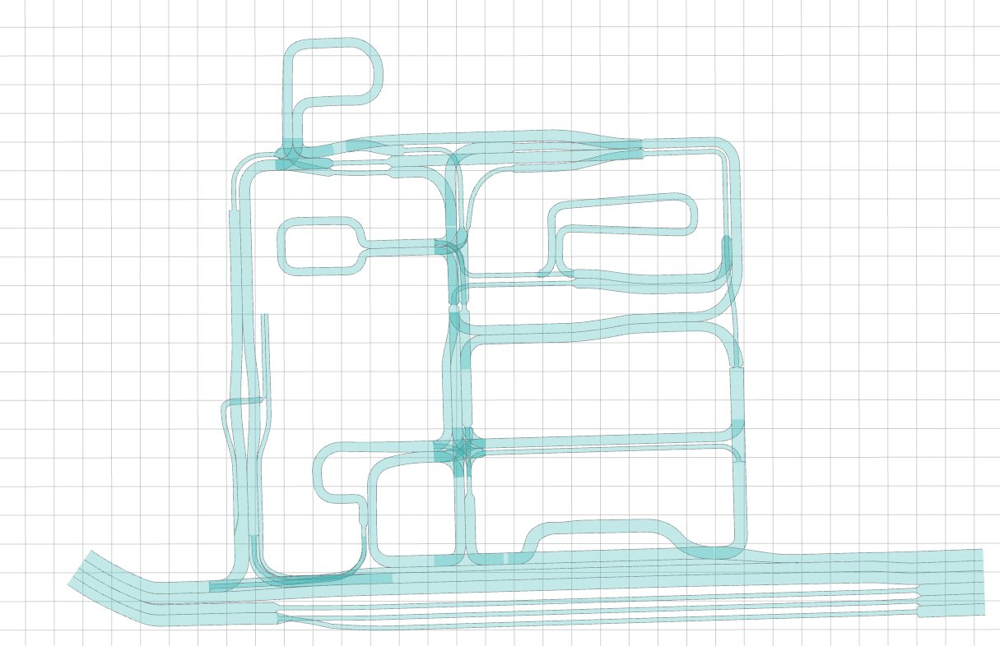
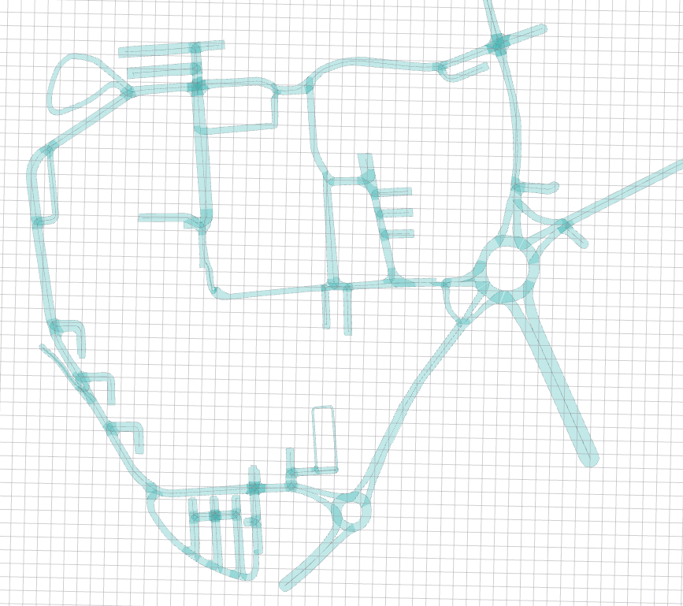

# Lanelet2_maps


Early stage lanelet2 maps from Győr and ZalaZone, created by Krisztián Enisz and Mátyás Mesics.

ZalaZone Maps origin in UTM coords: `[639770.000, 5195040.000, 0.000]` based on [map_zala_0](https://github.com/szenergy/szenergy-public-resources/wiki/H-TF) ROS tf frame [`33T` zone] ([There are several online UTM-WGS84 converters](https://coordinates-converter.com/en/decimal/46.894188434576925,16.8348613471017251?karte=OpenStreetMap&zoom=14))

GyorUni Maps origin in UTM coords: `[697237.000, 5285644.000, 0.000]` based on [map_gyor_0](https://github.com/szenergy/szenergy-public-resources/wiki/H-TF) ROS tf frame [`33T` zone]


## ZalaZone University track


## ZalaZone SmartCity track



## Győr campus



# Usage without ROS

- [Tier4 Tool](https://tools.tier4.jp/) - Vector Map Builder is a tool that helps to create a vector map from point cloud data.
- [Assure mapping tools](https://github.com/hatem-darweesh/assuremappingtools) - Desktop based tool for viewing, editing and saving road network maps for autonomous vehicle platforms such as Autoware.
- [MapToolbox](https://github.com/autocore-ai/MapToolbox) - Plugins to make Lanelet2/vector_map in Unity
- [JOSM](https://josm.openstreetmap.de/) - Java OpenStreetMap Editor

There are numerous solutions for  UTM-WGS84 conversion in [python](https://github.com/Turbo87/utm), in [c++](https://github.com/szenergy/duro_gps_driver/blob/master/src/utm.cpp) or in [MATLAB](https://www.mathworks.com/matlabcentral/fileexchange/14804-wgs2utm-version-2). 

## Python

```
pip install utm
```

UTM-WGS84 conversion
``` python
import utm
utm.to_latlon(639770.000, 5195040.000, 33, 'T')
```
Result
``` cs
(46.894188434576925, 16.834861347101725)
```

WGS84-UTM conversion
``` python
import utm
utm.from_latlon(47.69405596312653, 17.62866888484998)
```
Result
```cs
(697237.0000192814, 5285644.004006204, 33, 'T')
```

# Usage with ROS

```
cd ~
https://github.com/jkk-research/lanelet2_maps
```

```
cd catkin_ws/src
git clone https://github.com/mesmatyi/common
catkin build map_file
```
```
roslaunch map_file lanelet2_map_loader_zala.launch 
```
Other handy commands

``` cs
rosrun tf static_transform_publisher 429.0 -1455.0 0.0 0.0 0.0 0.0 map_zala_0 map_zala_1 50 
rosrun tf static_transform_publisher 200.0 68.0 0.0 0.0 0.0 0.0 map_zala_0 map_zala_2 50  
rosrun tf static_transform_publisher -40.0 -40.0 0.0 0.0 0.0 0.0 map_gyor_0 map_gyor_1 50  
```
Alternative:
- [lanelet_rviz_plugin_ros](https://github.com/coincar-sim/lanelet_rviz_plugin_ros) - Rviz Plugin for displaying a lanelet2 map.


# Usage with ROS 2

- [`lanelet2_rviz2` ROS2 package](https://raw.githubusercontent.com/jkk-research/lanelet2_rviz2/refs/heads/master/etc/lanelet_visu01.png) - `lanelet2_rviz2` loads the Lanelet2 `.osm` files and displays it as a `visualization_msgs/MarkerArray`. Minimum dependency package.
- [Autoware Universe](https://autowarefoundation.github.io/autoware-documentation/main/design/autoware-interfaces/components/map/#lanelet2-map) - [`map_loader` package](https://github.com/autowarefoundation/autoware.universe/tree/main/map/map_loader)


