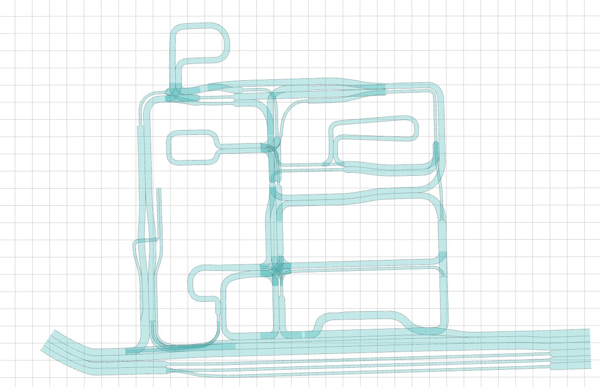
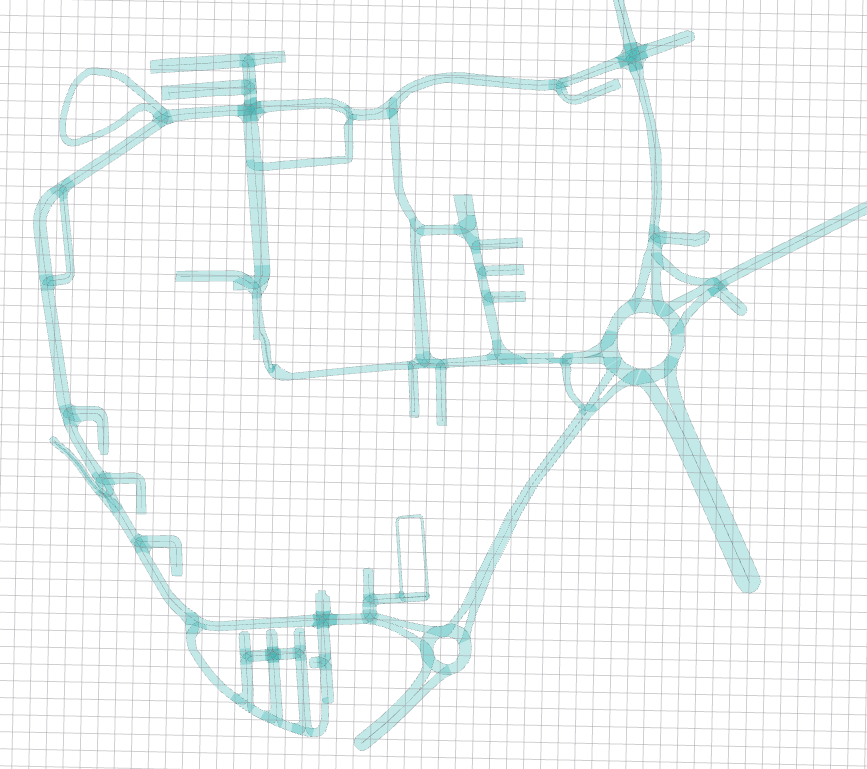

# Lanelet2_maps


Early stage lanelet2 maps from Győr and ZalaZone, created by Krisztián Enisz and Mátyás Mesics.

ZalaZone Maps origin in UTM coords: `[639770.000, 5195040.000, 0.000]` based on [map_zala_0](https://github.com/szenergy/szenergy-public-resources/wiki/H-TF) ROS tf frame [`33T` zone]

GyorUni Maps origin in UTM coords: `[697237.000, 5285644.000, 0.000]` based on [map_gyor_0](https://github.com/szenergy/szenergy-public-resources/wiki/H-TF) ROS tf frame [`33T` zone]


## ZalaZone University track


## ZalaZone SmartCity track



## Győr campus



# Usage with ROS

```
cd ~
https://github.com/jkk-research/lanelet2_maps
```

```
cd catkin_ws/src
git clone https://github.com/mesmatyi/common
catkin build map_file
```
```
roslaunch map_file lanelet2_map_loader_zala.launch 
```
Other handy commands

```
rosrun tf static_transform_publisher 429.0 -1455.0 0.0 0.0 0.0 0.0 map_zala_0 map_zala_1 50 
rosrun tf static_transform_publisher 200.0 68.0 0.0 0.0 0.0 0.0 map_zala_0 map_zala_2 50  
rosrun tf static_transform_publisher -40.0 -40.0 0.0 0.0 0.0 0.0 map_gyor_0 map_gyor_1 50  
```