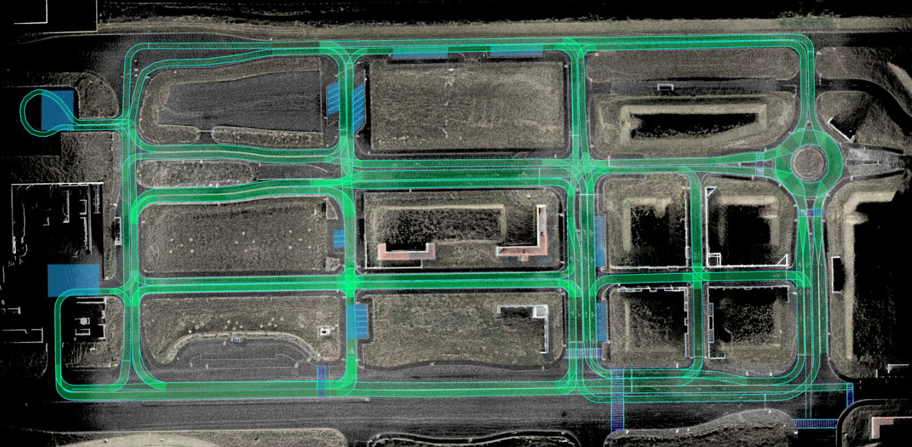
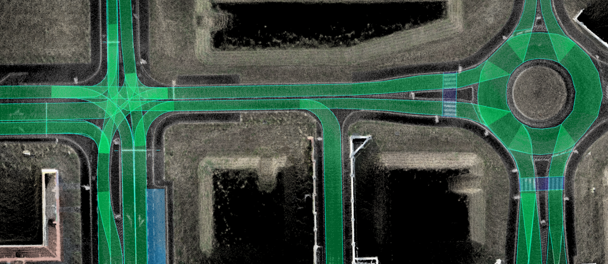

# ZalaZone Lanelet2 Maps

## Smart city
The smart city is a state-of-the-art module at AVL ZalaZONE Proving Ground and a European ADAS/AD test infrastructure benchmark with its 5 sub-modules or different urban testing environments.

The map is designed for autonomous vehicle testing and development in a controlled urban environment.

## University test track
The University Test Track is a dedicated module for educational and research purposes, providing a controlled environment for students and researchers.

## Motorway
The purpose of the Motorway is to provide a realistic environment, which is particularly important for testing and validating the ADAS system.

## Handling course
The high-speed handling course has the following physical characteristics: a length of 2000 m, a width of 12 m, a soft gravel / asphalt run-off-area, and a 80 cm basalt base/foundation allowing for vehicles up to 40t.

## Dynamics platform
The dynamic platform has a 300 m diameter asphalt surface, an acceleration lane 760 m long with a 0% inclination, and a 20 m wide emergency surface surrounding the main.

## Rural roads
The rural road system is covering an internal road network with a total length of 2500m, including a 2x2 lane section of 500m and 130m long 10% banked road section.

## ADAS surface
All AD and ADAS related systems can be tested in compliance with all existing standards and requirements according to the most diverse NCAP scenarios.

## Hill Tracks
Conventional element for testing traction control systems like hill start assist function, hill holder systems, etc. The module can also be used for robustness and reliability tests of ADAS functions, like AEB system.

## Wet Handling Course
The low-speed or wet handling course is primarily used for testing tyres and electronic stability control systems, but can also be used for driving technique trainings.

## Pass-by Noise Track
The certified pass-by noise track and the Class 1 measurement equipment fulfil all the requirements for type approval, homologation, and COP measurements for any vehicle, including heavy-duty commercials.

## High-Speed Oval
AVL ZalaZONE’s latest development, the High-Speed Oval Track, will be fully operational from June 2025, designed to meet the highest standards of modern vehicle testing
